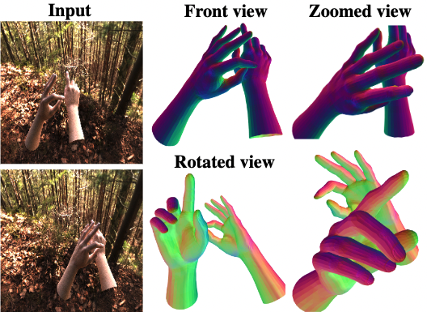

# Spectral Graphormer: Spectral Graph-based Transformer for Egocentric Two-Hand Reconstruction using Multi-View Color Images

Tensorflow implementation of the paper ["Spectral Graphormer: Spectral Graph-based Transformer for Egocentric Two-Hand Reconstruction using Multi-View Color Images"](https://arxiv.org/pdf/2308.11015.pdf), ICCV 2023.

[[Project page]](https://eldentse.github.io/Spectral-Graphormer/) [[arXiv]](https://arxiv.org/pdf/2308.11015.pdf) [[Code & Data (coming soon)]](https://github.com/google-research/google-research/spectral_graphormer)

<p align="center">  
 
</p> 

## Introduction
We propose a novel transformer-based framework that
reconstructs two high fidelity hands from multi-view RGB
images. As existing datasets are either infeasible for egocentric viewpoints or lack background variations, we create a large-scale synthetic dataset with diverse scenarios and collect a real dataset from multi-calibrated camera setup to verify our proposed multi-view image feature fusion strategy. To make the reconstruction physically plausible, we propose two
strategies: (i) a coarse-to-fine spectral graph convolution
decoder to smoothen the meshes during upsampling and (ii)
an optimisation-based refinement stage at inference to prevent self-penetrations.

## Citation

If you find this code useful in your research, please consider citing:

```bibtex
@inproceedings{tse2023spectral,
author = {Tse, Tze Ho Elden and Mueller, Franziska and Shen, Zhengyang and Tang, Danhang and Beeler, Thabo and Dou, Mingsong and Zhang, Yinda and Petrovic, Sasa and Chang, Hyung Jin and Taylor, Jonathan and Doosti, Bardia},
title = {Spectral Graphormer: Spectral Graph-based Transformer for Egocentric Two-Hand Reconstruction using Multi-View Color Images},
booktitle = {ICCV},
year = {2023}
}
```